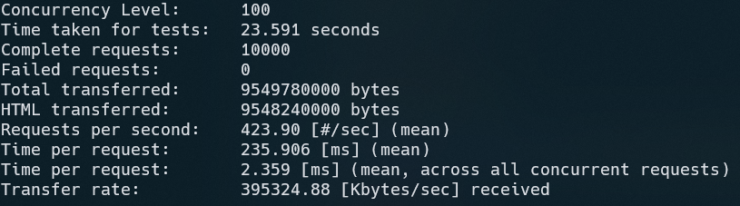
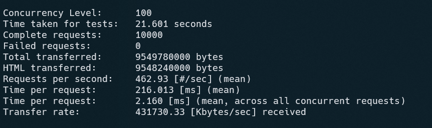
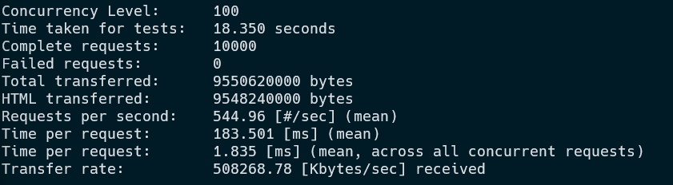

# Highload HTTP WebServer
> Language: C++ |
> Model: Thread Pool |
> [Task](https://github.com/init/http-test-suite)
#### Load test submodule
``` bash
git submodule update --init
```
## Build and run (for testing)
``` bash
docker build -t highload-webserver .
docker run -v $(pwd)/httpd.conf:/etc/httpd.conf:ro -v $(pwd)/http-test-suite:/var/www/html:ro --name highload-webserver-test --rm -d -p 8080:80 highload-webserver
```
## Functional testing
``` bash
cd http-test-suit
./httptest.py
```
## Load testing
> NEED TO ADD PORT
``` bash
ab -n 10000 -c 100 -s 5 127.0.0.1:PORT/httptest/wikipedia_russia.html
```
## Result
#### 1 threads

#### 12 threads

#### Nginx result (for compare)
``` bash
docker run --name highload-nginx-test -v $(pwd)/nginx.conf:/etc/nginx/nginx.conf:ro -v $(pwd)/http-test-suite:/var/www/html:ro -d --rm -p 9090:80 nginx:stable
```

